# ShaderAmp

is a free browser plugin for visualizing music on any website. It works with YouTube, Spotify, Soundcloud and so on.

It started as a proof of concept project to see if I could create a manifest v3 extension to visualize Spotify and Youtube music.

It's inspired by [afreakk](https://github.com/afreakk)'s [ChromeAudioVisualizerExtension](https://github.com/afreakk/ChromeAudioVisualizerExtension), but does not use [butterchurn](https://github.com/jberg/butterchurn).

Instead, I used this project to learn how to use ShaderToy.com shaders in THREE.js.

Also, I didn't like that the ChromeAudioVisualizer renders on the same content page. This made it difficult to switch between songs while the visualization was running.

***Note***: I'm not the original author of the shaders. I simply adapted them to run with THREE.js and made some of them more aware of the music input.

This project is based on [Chrome Audio Capture](https://github.com/zhw2590582/chrome-audio-capture)

## Installation

If you don't know how to install an unpacked browser extension then you might find [this link](https://developer.chrome.com/docs/extensions/mv3/getstarted/development-basics/#load-unpacked) usefull

After installation you will find a new extension icon which you can click once your tab is playing music.

## Usage hints

- Please keep in mind, that you have to start the music before you enable the extension.

- Some shaders require a powerful GPU in order to run smooth. If you don't have a powerful GPU, then you shouldn't run the extension in fullscreen. I recommend a 720p resolution for fullscreen.

## Keys

Use 'a' to 'z' to switch between different shaders.

0-9 keys jump to a certain time/scene within the Shader. It's currently specifically for the "Gato Negro Pasa" shader.

The left and right arrow keys jump in the shader time back and forward.

The up and down arrow keys slow down or speed up the shader time.

Use '-' to enable/disable the analyzer.

Press '.' to enable/disable auto switching between shaders.

Hit the ',' key to toggle the Shader credits.

Press '#' to toggle "insert_mode". In "insert_mode" you can write some text on the screen.

## Shader Credits

### Symbolism

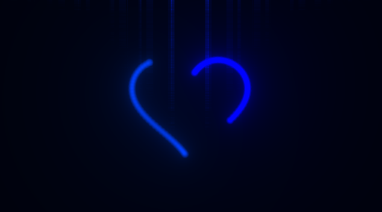

[Symbolism 0.74.230405](https://www.shadertoy.com/view/DsVXz1) by QuantumSuper

### Gato Negro Pasa

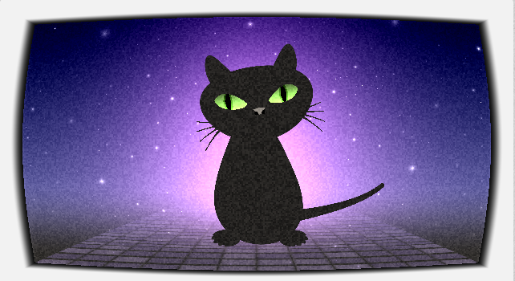

[Gato Negro Pasa](https://www.shadertoy.com/view/WdB3zz) by Kali

### PsychedelicEye

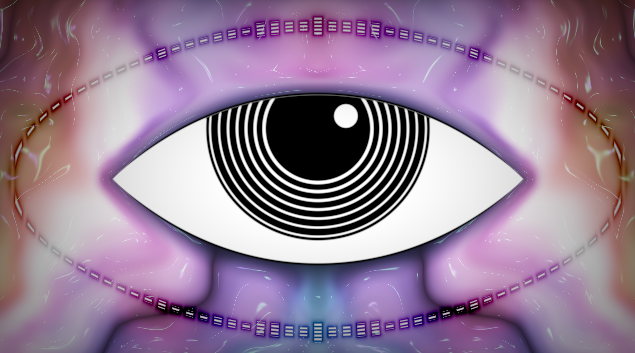

[Psychedelic Eye](https://www.shadertoy.com/view/fllSD8) by mrange

### Solum Object

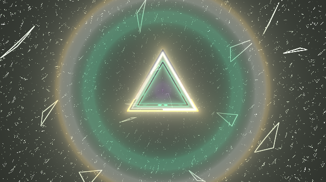

[Solum Object 0.52.230509](https://www.shadertoy.com/view/mtKGRW) by QuantumSuper

### AudioReactiveScene1stAttempt

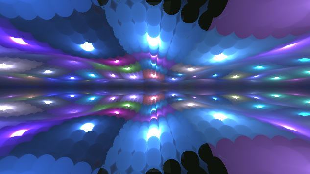

[Audio-reactive scene 1st attempt](https://www.shadertoy.com/view/cslSRr) by kishimisu

### Hexagone

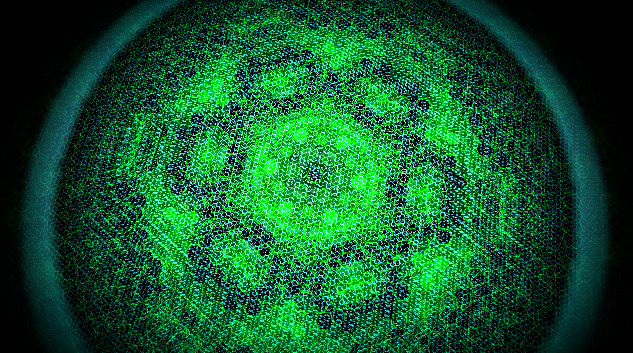

[Hexagone](https://www.shadertoy.com/view/wsl3WB) by Martijn Steinrucken aka BigWings

### StarFieldArtOfCode

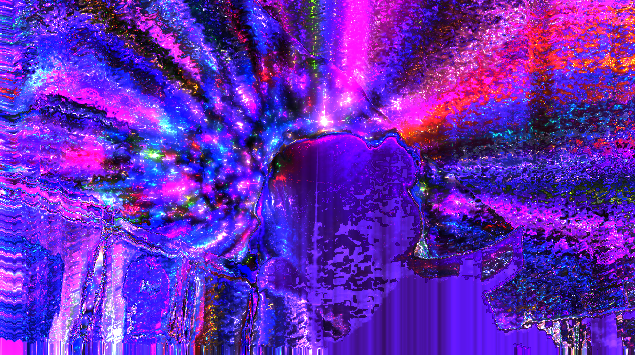

[Star Field - the Art of code](https://www.shadertoy.com/view/flBSWh) by Chriscamplin

### Warp speed

[Warp Speed](https://www.shadertoy.com/view/Msl3WH) by David Hoskins 2013

### Otherworldy

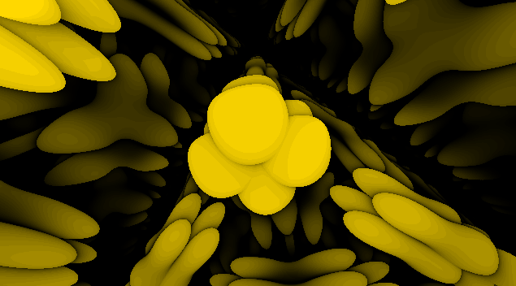

[Otherworldy](https://www.shadertoy.com/view/MlySWd) by lherm

### Shit just got real

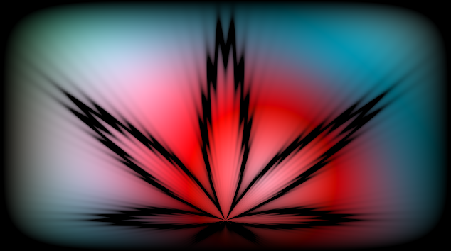

[Shit just got real](https://www.shadertoy.com/view/Xdjczt) by db0x90

### fft experiment

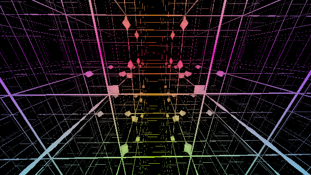

[fft experiment](https://www.shadertoy.com/view/4tK3zG) by nshelton

### frequency balls

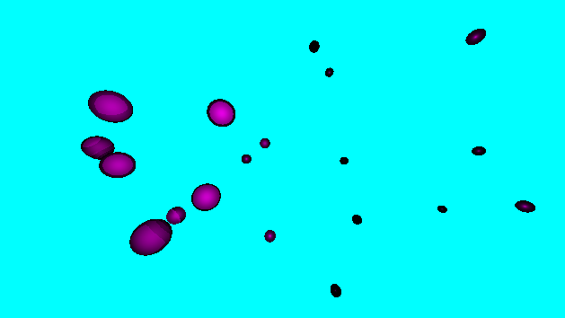

[frequency balls](https://www.shadertoy.com/view/4scGW2) by nshelton

### inFX.1b

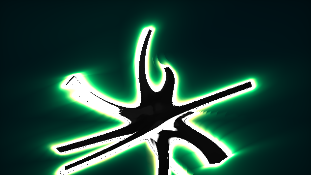

[inFX.1b](https://www.shadertoy.com/view/ldd3Dr) by patu

### Basic Audio Visualizer

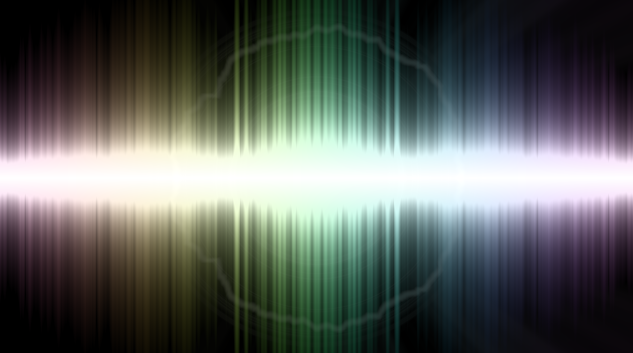

[Basic Audio Visualizer](https://www.shadertoy.com/view/lsdGR8) by chronos

### 3D Audio Visualizer

[3D Audio Visualizer](https://www.shadertoy.com/view/dtl3Dr) by kishimisu

### Abstract Music

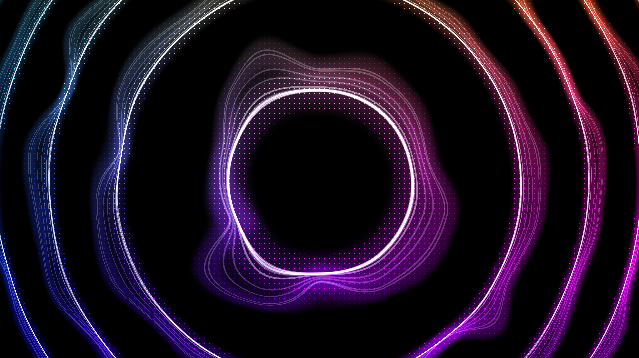

[Abstract Music](https://www.shadertoy.com/view/4stSRs) by MatHack

### Moving without travelling

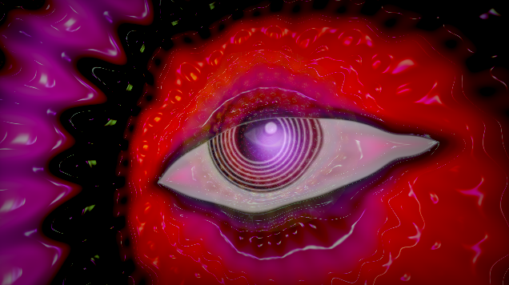

[Moving without travelling](https://www.shadertoy.com/view/NtXSzl) by mrange

### Sound Oscilloscope from spectrum

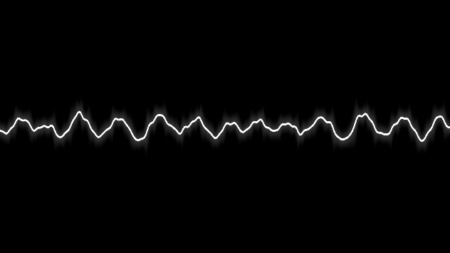

[Sound Oscilloscope from spectrum](https://www.shadertoy.com/view/Ws2GWD) by jaszunio15

### Vinyl Visualizer

[Vinyl Visualizer](https://www.shadertoy.com/view/XlcXDX) by s23b

### READY PLAYER ONE

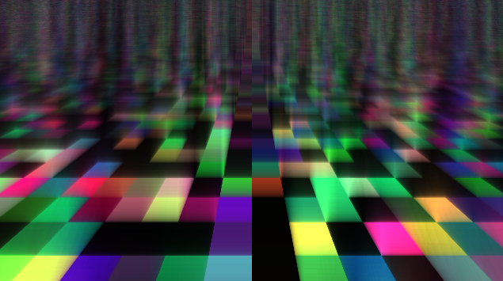

[READY PLAYER ONE](https://www.shadertoy.com/view/Xd2fD1) by Nestor Vina aka Nesvi7

### Neon Octagonal Audio Visualizer

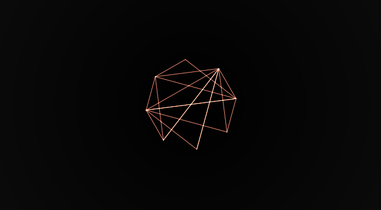

[Neon Octagonal Audio Visualizer](https://www.shadertoy.com/view/Wd23Rw) by Emiel

### Sonic Pulse

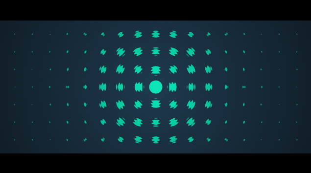

[Sonic Pulse](https://www.shadertoy.com/view/4dcyD2) by WillKirkby

### Fluidic Space

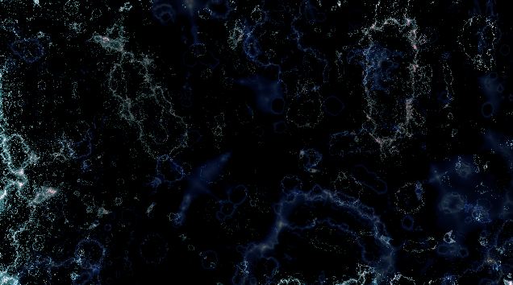

[Fluidic Space](https://www.shadertoy.com/view/tdS3DD) by EnigmaCurry

### Musical Heart

[Musical Heart](https://www.shadertoy.com/view/4dK3zD) by hunter

### Informer

[Informer](https://www.shadertoy.com/view/XtKXDh) by voz

### FFT Strings

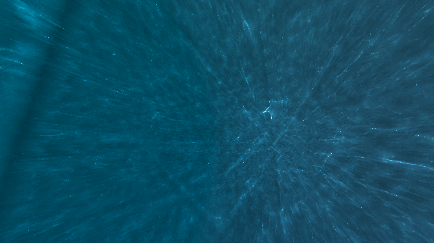

[FFT Strings](https://www.shadertoy.com/view/4lyBR3) by RaduBT

### SpaceTravel Video

<https://www.youtube.com/watch?v=3BBJQmnG_fQ>
