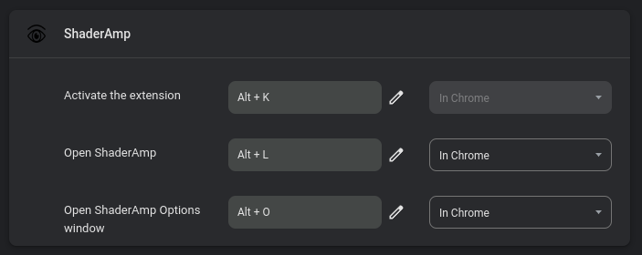

# ShaderAmp

is a free browser plugin for visualizing music on any website. It works with YouTube, Spotify, Soundcloud and so on.

It started as a proof of concept project but became something bigger over time.

***Note***: We are not related to shadertoy.com and we're not the original authors of the shaders.
We simply adapted them to run with THREE.js and made some of them more aware of the music input.
(The authors of the shaders might say that we've screwd them up 😅)

## Example Visualization

[](https://www.youtube.com/watch?v=5LPhK8k_xEI)


## Features

### Browser support

- **Chrome / Chromium** — primary target; full `tabCapture` audio support.
- **Firefox** — basic support via `getDisplayMedia`. Because Firefox does not support `tabCapture`, ShaderAmp prompts you to share a tab or window each time it opens. The shared tab's video appears as the visual background and its audio is used as the input signal.

### Audio input sources

- **Tab audio** (Chrome default) — captures audio from the active browser tab silently in the background.
- **Webcam audio** *(experimental)* — uses the microphone/webcam as the audio source, overriding tab audio.
- **Screen / window / tab share** — captures audio and video from any screen, window, or tab via `getDisplayMedia`. This is also the default path on Firefox.

### Shader playback & settings

- Large built-in shader library, organized into named tabs in the options page.
- Cycle through shaders with the prev/next buttons in the options sidebar, or via MIDI controls.
- **Randomize shader** on a configurable timer and/or on beat (configurable beat interval).
- **Fade transitions** between shaders for smooth switching.
- **Render resolution** selector (25 % – 100 %) to tune performance on slower hardware.
- **Speed divider** and **volume amplifier** sliders.
- **`iAmplifiedTime`** — an audio-reactive time uniform updated every frame; can optionally be injected into imported Shadertoy shaders.
- Toggle overlays: FPS counter, tab title, shader credits.
- Show/hide individual shaders from the list.

### Shader import from shadertoy.com

- Import any public Shadertoy shader directly by URL or by pasting its JSON.
- Automatic GLSL conversion: entry-point wrapping, uniform mapping, multipass buffer wiring.
- **Optional asset download**: when enabled, ShaderAmp reads Shadertoy textures, videos, and cubemaps from the browser cache and stores them locally in IndexedDB for offline use — no redundant network requests.
- Manage imported shaders: edit, delete, assign to custom tabs.

See [SHADERTOY_TO_SHADERAMP.md](SHADERTOY_TO_SHADERAMP.md) for the manual porting guide.

### In-browser shader editor

- Full-screen CodeMirror GLSL editor with syntax highlighting (One Dark theme).
- Multipass support: edit Image pass and Buffer A–D in separate tabs.
- **Custom uniforms editor** — expose per-shader float/int/color/bool knobs that appear in the UI and can be mapped to MIDI or joystick.
- **AI assistant side panel** — generate or modify shaders via chat (see AI section below).
- Save as a new imported shader or overwrite an existing one.

### Custom media assets

- Upload custom **images** (PNG, JPG, WebP, …) as shader texture inputs — drag-and-drop supported.
- Upload custom **videos** (MP4, WebM, …) as shader video inputs — drag-and-drop supported.
- Upload custom **cubemaps** as a ZIP archive containing 6 face images.
- All assets are stored in IndexedDB and survive browser restarts.
- Assets are assignable to `iChannel0`–`iChannel3` in shader metadata.
- Storage quota indicator shows current usage.

### MIDI support

- Enable/disable MIDI input globally.
- Map any MIDI CC knob or note-on/off to:
  - Previous / next shader
  - Reset time
  - Toggle beat randomize
  - Speed divider (continuous knob)
  - Volume amplifier (continuous knob)
  - Inject note into FFT
  - Any custom shader uniform
- **MIDI learn mode** — just press Learn and wiggle the knob/key.
- Hot-plug detection: new MIDI devices are picked up automatically without restarting.

### Joystick / Gamepad support

- Enable/disable gamepad input globally (uses the standard Web Gamepad API — no drivers needed, works in Chrome and Firefox).
- Map any **axis** (analog stick, trigger) or **button** to:
  - Previous / next shader
  - Reset time
  - Toggle beat randomize
  - Speed divider (continuous axis)
  - Volume amplifier (continuous axis)
  - Inject axis position into FFT
  - Any custom shader uniform
  - Select a specific shader by ID
- **Gamepad learn mode** — click Learn then move a stick or press a button to auto-detect the source.
- Supports multiple simultaneous gamepads (indexed 0–3).
- **`iJoystick` texture uniform** — a 32×4 `sampler2D` exposed to all shaders:
  - Row 0: axis values, normalised 0–1 (128/255 = centre)
  - Row 1: buttons currently held (255 = pressed)
  - Row 2: buttons just-pressed this frame (255 for one frame)
  - Row 3: buttons just-released this frame (255 for one frame)
- Gamepad mappings are stored persistently alongside MIDI mappings in extension storage.

### AI shader assistant

Generate and iterate on shaders using natural language directly inside the shader editor. Supported providers:

| Provider | Notes |
|---|---|
| Chrome Built-in AI (Gemini Nano) | On-device; requires Chrome flags `Enables optimization guide on device` + `Prompt API for Gemini Nano` |
| Google Gemini API | Free tier available; get a key at [aistudio.google.com](https://aistudio.google.com/app/apikey) |
| OpenRouter | Access GPT-4o, Claude, Mistral and many others with one API key |
| Ollama | Self-hosted local models (e.g. Llama 3.2, CodeLlama); start with `OLLAMA_ORIGINS="*" ollama serve` |

The assistant is context-aware: it sends the current shader code and all buffer codes along with your prompt. Generated code can be inserted directly into the editor.

### Webcam video input

- Use webcam video as a visual background texture (`iVideo` / `iChannel`).
- Combine with webcam audio for a fully camera-driven visualization.

### Debug tools

- **Debug logging** toggle — captures logs from all extension contexts (background, content, options).
- **Debug log viewer** — inspect captured logs inside the options page without opening DevTools.


## Installation

If you don't know how to install an unpacked browser extension then you might find [this link](https://developer.chrome.com/docs/extensions/mv3/getstarted/development-basics/#load-unpacked) usefull

After installation, you will find a new extension icon which you can click to open ShaderAmp.

The latest version is now available on [Chrome Web Store](https://chromewebstore.google.com/detail/shaderamp/pbgkhemojiabmajgkcgjelgpnpoddcgl)!

**Firefox users:** install the extension as a temporary add-on via `about:debugging` → *This Firefox* → *Load Temporary Add-on*, or build a signed XPI. When ShaderAmp opens, Firefox will ask you to share a tab or window to capture audio and video.

## Usage hints

- **Use it at your own risk. We are not responsible for any damage to your hardware or data in the event of a browser crash.**

- Some shaders require a **powerful** GPU in order to run smooth. If you don't have a powerful GPU, then you shouldn't run the extension in fullscreen. We recommend a 720p or max. 1080p resolution for fullscreen.

- If you have multiple graphics cards, Windows/Linux/macOS always starts the browser by default on the integrated graphics card. We recommend configuring the browser to always render with the dedicated graphics card in the operating system settings.

## Keys

Use 'alt' + L to open ShaderAmp

Use 'alt' + O to open ShaderAmp options

As an alternative to keyboard shortcuts, you can use MIDI controllers or gamepads/joysticks to cycle shaders, control speed, volume, and more — see the **MIDI support** and **Joystick / Gamepad support** sections above.

## Development

### Prerequisites
- npm
- node

### Installing ShaderAmp dependencies

```bash
npm install
```

### Compiling ShaderAmp

```bash
npm run build
```

### Running the ShaderAmp in dev mode

```bash
npm run dev
```

### Building for a specific browser

The plain `npm run build` keeps the combined manifest (works for both browsers and is the source of truth for the `dist/` folder).

Use the browser-specific scripts when preparing a store submission — they strip keys that are irrelevant or flagged by each store's validator:

```bash
npm run build:chrome   # webpack build + remove Firefox-only manifest keys (browser_specific_settings, background.scripts)
npm run build:firefox  # webpack build + remove Chrome-only manifest keys (tabCapture permission)
```

> **Note:** `build:chrome` and `build:firefox` overwrite `dist/manifest.json` in-place.
> Run `git restore dist/manifest.json` (or `git checkout dist/manifest.json`) to restore the combined manifest after a browser-specific build or run `npm run build` without the browser vendor name to rebuild with the combined manifest.

## Shader Credits

You will find the original shader authors in the shaders and in the [dist/shaders/README.md](dist/shaders/README.md) file.


## How to change ShaderAmp Shortcuts

ShaderAmp binds per default the following shortcuts:
- ALT + L: Open ShaderAmp
- ALT + O: Open ShaderAmp Options
- ALT + K: Activate the extension


If you want to change these shortcuts you can do so by opening

`chrome://extensions/shortcuts`

in Chrome and change the shortcuts for ShaderAmp. (Firefox does not support this page; shortcuts are not configurable in Firefox.)




## Need help or got questions?

Join our Discord: https://discord.gg/yWdddj9Z5V


## Like what you get?

Give this project a ⭐ and consider becoming a [ShaderToy Patreon](https://www.patreon.com/shadertoy)


## Credits

ShaderAmp has multiple contributors and sources. ShaderAmp wouldn't exist without them.

| What | Who | License |
|---|---|---|
| [shadertoy.com](https://www.shadertoy.com/) | Inigo Quilez and team | — |
| [Shadertoy Chrome Plugin](https://github.com/patuwwy/ShaderToy-Chrome-Plugin) | Patu | — |
| three.js | Ricardo Cabello (mrdoob) | MIT |
| [react-three/fiber & drei](https://github.com/pmndrs/react-three-fiber) | pmndrs | MIT |
| ShaderAmp | Eamon Woortman, Philipp Kühn, Kai Rathmann, Jonathan R. Warden, ArthurTent | MIT |
| ShaderAmp Icon | Franz | CC0 |
| ShaderAmp release Party | [c-base](http://c-base.de/) | sorry, you missed it |
| Cubemap faces (abc.jpg) | [Leen Abdul Wahed](http://instagram.com/leen.oaw) | CC0 |
| Cubemap faces (94284d43…_1–_5) | M. Maher Mhalhal | CC0 |
| Nyan Cat Sprite | [prguitarman (Chris Torres)](https://www.nyan.cat) | Non-commercial license for ShaderAmp |
| Font / ASCII texture | [otaviogood](https://www.shadertoy.com/user/otaviogood) / [github](https://github.com/otaviogood/shader_fontgen) | CC0 |
| Mountain / landscape texture | [Eberhard Grossgasteiger](https://www.pexels.com/photo/966927) | Pexels License |
| Concrete / stone texture | [Piyapong Sayduang](https://www.pexels.com/photo/5622880) | Pexels License |
| Organic / landscape texture | [Pierre Bamin](https://unsplash.com/photos/_EzTds6Fo44) | Unsplash License |
| Night sky / milky way texture | [Milky Way at night](https://www.pickpik.com/sky-night-milky-way-star-constellations-star-space-138344) | Public Domain |
| 38C3 visuals | [38C3 Styleguide](https://events.ccc.de/congress/2024/infos/styleguide.html) | CC0 |

Special thanks to: Patu, cven, mecci, epunk, ligi, alg, all c-base members, creative code berlin, and last but not least, my wife for being patient with me.

## License

This project is licensed under the MIT License - see the [LICENSE](LICENSE) file for details.
However, the shaders are licensed under different licenses. Most of them are licensed under the Creative Commons Attribution-NonCommercial-ShareAlike 3.0 Unported License.
Some are using Creative Commons Attribution-NonCommercial-ShareAlike 4.0 International License or MIT License.
You can find more information about the license in the [shaders](dist/shaders) folder.
Each Shader file has a link to the original shader and the license. DO NOT REMOVE THIS INFORMATION.

## Third-Party Licenses

For a list of all third-party dependencies and their licenses, see [third_party_licenses.md](dist/third_party_licenses.md).

ShaderAmp
<sup><sup>All your BASS are belong to us!<sup></sup>
