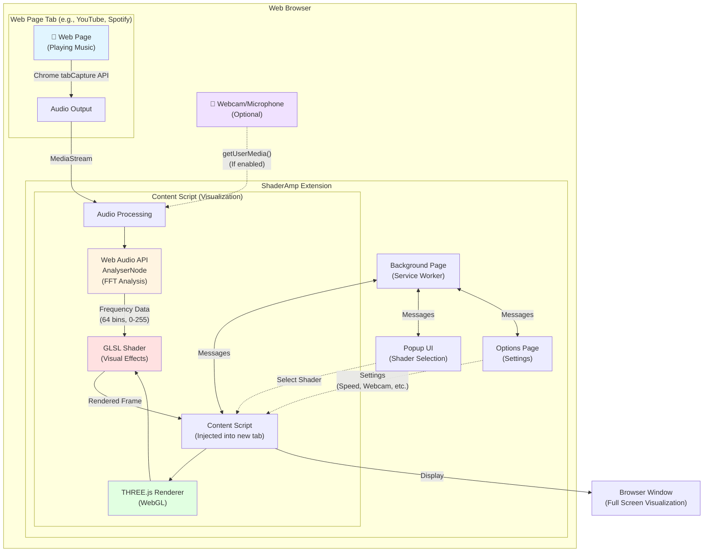
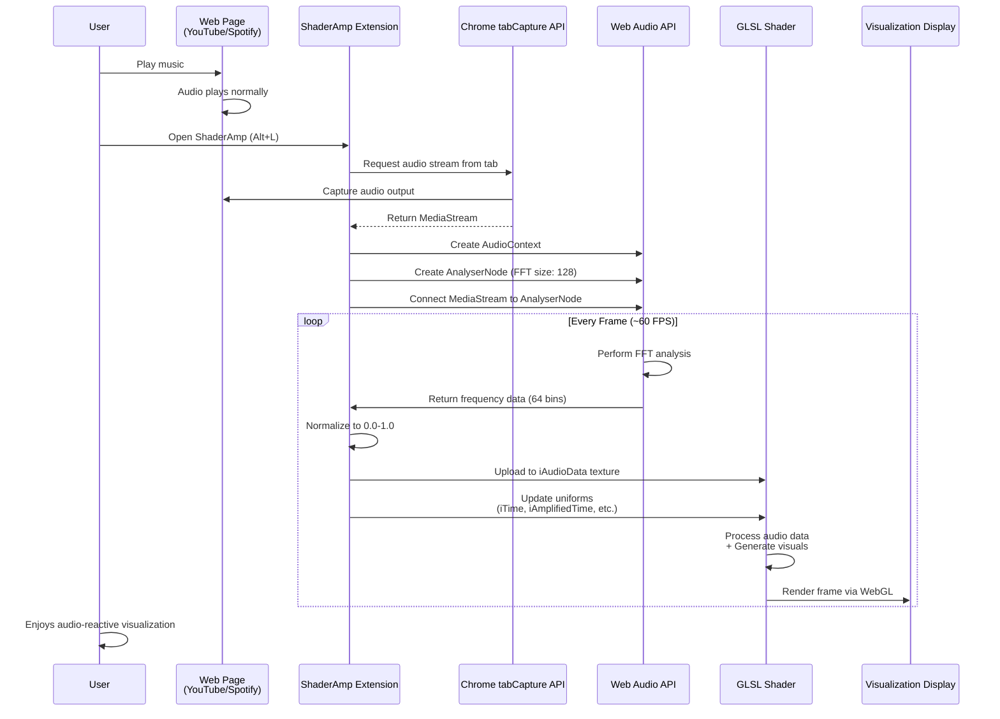
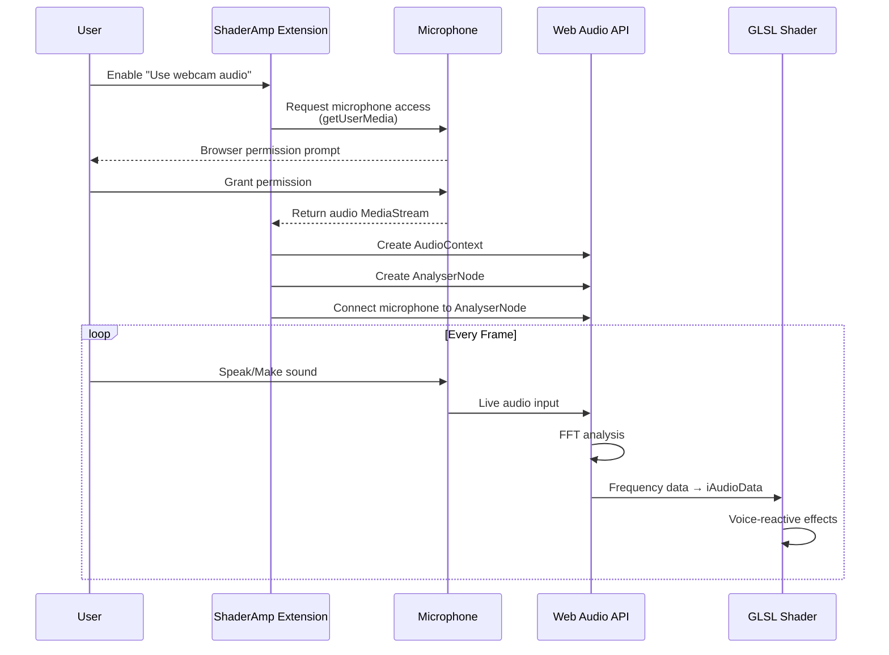

# ShaderAmp Shader Parameters Documentation

Complete reference for all parameters and uniforms available to shaders in ShaderAmp.

## Table of Contents
- [Overview](#overview)
  - [Architecture Diagram](#architecture-diagram)
  - [Audio Stream Flow](#audio-stream-flow)
  - [Key Components](#key-components)
- [Uniform Parameters](#uniform-parameters)
  - [Time Parameters](#time-parameters)
  - [Audio Parameter](#audio-parameter)
  - [Mouse Parameter](#mouse-parameter)
  - [Keyboard Parameter](#keyboard-parameter)
  - [Texture Parameters](#texture-parameters)
  - [GLSL Variables](#glsl-variables)
- [Webcam Features](#webcam-features)
- [Metadata Configuration](#metadata-configuration)
- [Multipass Rendering](#multipass-rendering)
- [Examples](#examples)

---

## Overview

ShaderAmp provides shaders with a standard set of uniforms for creating audio-reactive visualizations. All shaders automatically receive these parameters from the `AnalyzerMesh` component.

### Architecture Diagram



### Audio Stream Flow



### Alternative: Webcam Audio Flow



### Key Components

**1. Chrome tabCapture API**
- Captures audio output from any browser tab
- Returns a MediaStream object
- Requires tab permission in manifest

**2. Web Audio API**
- Creates AudioContext for audio processing
- AnalyserNode performs real-time FFT (Fast Fourier Transform)
- Converts audio into frequency domain data

**3. THREE.js + WebGL**
- Renders shaders using hardware acceleration
- Passes uniforms (audio data, time, resolution) to shaders
- Handles video/texture loading

**4. GLSL Shaders**
- Fragment shaders process audio data
- Create visual effects based on frequency/amplitude
- Run on GPU for real-time performance

**5. Content Script**
- Injected into a new browser tab
- Orchestrates entire visualization pipeline
- Manages audio capture, analysis, and rendering

---

## Uniform Parameters

### Time Parameters

#### `uniform float iAmplifiedTime;`
**Audio-reactive time value**
- Type: `float`
- Reacts to music amplitude and intensity
- Calculation: `baseTime × audioRate × shaderSpeed`
- Use for: Main animations that sync with music by using it as time
- Initial value: `0.1`

#### `uniform float iTime;`
**Standard elapsed time**
- Type: `float`
- Linear progression in seconds
- Independent of audio amplitude
- Use for: Steady time based animations
- Initial value: `0.1`

#### `uniform float iTimeDelta;`
**Time delta between frames**
- Type: `float`
- Time elapsed since last frame in seconds
- Varies with frame rate (typically ~0.016 for 60 FPS)
- Use for: Frame-rate independent animations, physics simulations
- Value: Updated each frame with `clock.getDelta()`

#### `uniform vec4 iDate;`
**Current date and time**
- Type: `vec4(year, month, day, secondsSinceMidnight)`
- Components:
  - `.x` = Year (e.g., 2025)
  - `.y` = Month (0-11)
  - `.z` = Day (1-31)
  - `.w` = Seconds since midnight
- Use for: Real-time clock displays, date-based effects

#### `uniform int iFrame;`
**Frame counter**
- Type: `int`
- Increments by 1 each frame
- Use for: Frame-accurate effects, temporal algorithms
- Initial value: `0`

### Audio Parameter

#### `uniform sampler2D iAudioData;`
**Audio frequency data texture**
- Type: `sampler2D`
- Format: Single channel (Red/Luminance)
- Values: `0.0` to `1.0` (normalized from 0-255 bytes)
- X-axis: Frequency (0.0=bass, 1.0=treble)
- Source: Web page audio (or webcam microphone if enabled)
- FFT Size: Configurable via `.meta` file (supports powers of 2, e.g., 32, 64, 128, 256, 512, 1024, 2048)

**Access patterns:**
```glsl
// Normalized frequency (0.0 to 1.0)
float freq = texture(iAudioData, vec2(frequency, 0.25)).x;

// **Specific bin (0 to 511 by default, or fftSize/2 - 1 if customized)**
float freq = texelFetch(iAudioData, ivec2(binIndex, 0), 0).x;

// Common helper functions:
float bass = texture(iAudioData, vec2(0.05, 0.25)).x;
float mid = texture(iAudioData, vec2(0.25, 0.25)).x;
{{ ... }}
float treble = texture(iAudioData, vec2(0.75, 0.25)).x;
```

### Mouse Parameter

#### `uniform vec4 iMouse;`
**Mouse position and button state**
- Type: `vec4(x, y, z, w)`
- Components:
  - `.xy` = Current mouse position (pixels)
  - `.zw` = Click position (pixels, negative when mouse is up)
- Coordinates in pixels
- Default: `vec4(screenWidth/2, screenHeight/2, 0, 0)`
- Use for: Interactive effects
- **Note**: Currently only `.xy` is implemented (mouse position). `.zw` always returns `(0, 0)`

### Keyboard Parameter

#### `uniform sampler2D iKeyboard;`
**Keyboard state texture (ShaderToy compatible)**
- Type: `sampler2D`
- Size: `256x4` pixels
- Format: Single channel (Red/Luminance)
- Values: `0.0` to `1.0` (normalized from 0-255 bytes)
- **Texture layout:**
  - **Row 0 (y=0)**: Key down state (255 = key is currently pressed, 0 = key is up)
  - **Row 1 (y=1)**: Key pressed state (255 = key just pressed this frame, 0 = not pressed)
  - **Row 2 (y=2)**: Key released state (255 = key just released this frame, 0 = not released)
  - **Row 3 (y=3)**: Key hold time (0.0-1.0 based on how long key has been held)

**Key mapping:**
- X-axis: Key code (0-255, corresponds to `event.keyCode`)
- Common keys:
  - `32` = Space
  - `65-90` = A-Z
  - `48-57` = 0-9
  - `37-40` = Arrow keys
  - `13` = Enter
  - `27` = Escape

**Access patterns:**
```glsl
// Check if a specific key is currently down
float spaceDown = texelFetch(iKeyboard, ivec2(32, 0), 0).x; // Space key

// Check if key was just pressed this frame
float spacePressed = texelFetch(iKeyboard, ivec2(32, 1), 0).x; // Space key

// Check if key was just released this frame  
float spaceReleased = texelFetch(iKeyboard, ivec2(32, 2), 0).x; // Space key

// Get how long key has been held (0.0-1.0)
float spaceHoldTime = texelFetch(iKeyboard, ivec2(32, 3), 0).x; // Space key

// Example usage
if (spaceDown > 0.5) {
    // Space bar is held down
    color *= vec3(1.0, 0.5, 0.5); // Red tint
}

if (spacePressed > 0.5) {
    // Space bar was just pressed this frame
    // Trigger one-time action
}

if (spaceReleased > 0.5) {
    // Space bar was just released this frame
    // Stop action
}
```

**Important notes:**
- Row 1 (pressed) and Row 2 (released) are automatically cleared each frame
- Only use these for edge detection (press/release events)
- Use Row 0 for continuous key state checking
- Row 3 provides normalized hold time for gradual effects

### Texture Parameters

#### `uniform sampler2D iChannel0;`
#### `uniform sampler2D iChannel1;`
#### `uniform sampler2D iChannel2;`
#### `uniform sampler2D iChannel3;`
**Texture channels**
- Type: `sampler2D`
- Can contain: Images or buffer outputs
- Wrapping: `RepeatWrapping` (allows tiling)
- Configuration: Via `.meta` file

**Default textures:**
- `iChannel0`: Sky/stars image
- `iChannel1`: Concrete texture
- `iChannel2`: NyanCat sprite
- `iChannel3`: NyanCat sprite

**Can reference:**
- Image files: `"images/texture.png"`
- Buffer outputs: `"buffer0"`, `"buffer1"`, `"buffer2"`, `"buffer3"`

#### `uniform sampler2D iVideo;`
**Video texture**
- Type: `sampler2D`
- Playback rate syncs with audio amplitude
- Loops continuously, muted
- Default: `media/SpaceTravel1Min.mp4`
- Configure via `"video"` in `.meta` file
- **Can be replaced with webcam video** (see [Webcam Features](#webcam-features))

### GLSL Variables

#### `varying vec2 vUv;`
**UV coordinates**
- Type: `vec2`
- Range: `0.0` to `1.0`
- Origin: Bottom-left
- Provided by vertex shader

**Common transformations:**
```glsl
// Center coordinates (-1 to 1)
vec2 uv = -1.0 + 2.0 * vUv;

// Centered with aspect correction
vec2 uv = (2.0 * vUv - 1.0) * vec2(iResolution.x / iResolution.y, 1.0);
```

---

## Webcam Features

ShaderAmp supports using your webcam as both a video source and an audio source, enabling real-time effects with your own camera and microphone.

### Webcam Video Input

**Enable**: ShaderAmp Options → "Use webcam video input"

- Replaces the `iVideo` uniform with live webcam feed
- Resolution: 1280×720 (720p)
- Camera: Front-facing (user) camera by default
- Permissions: Browser will request webcam access
- Falls back to default video if webcam unavailable

**Use cases:**
- Real-time video effects
- Face/motion reactive visualizations
- Augmented reality overlays
- Interactive performances

**Example shader:**
```glsl
uniform sampler2D iVideo;
uniform sampler2D iAudioData;
varying vec2 vUv;

void main() {
    // Get webcam video
    vec4 webcam = texture(iVideo, vUv);
    
    // Get audio reactivity
    float bass = texture(iAudioData, vec2(0.05, 0.25)).x;
    
    // Apply audio-reactive color grading
    vec3 color = webcam.rgb * (1.0 + bass * 0.5);
    
    gl_FragColor = vec4(color, 1.0);
}
```

### Webcam Audio Input

**Enable**: ShaderAmp Options → "Use webcam audio input"

- Replaces tab audio with microphone input for `iAudioData`
- Captures ambient sound or your voice
- Performs FFT analysis on microphone input
- Same frequency data format as regular audio
- Overrides the web page audio source

**Use cases:**
- Voice-reactive visualizations
- Live music/DJ performances
- Interactive installations
- Ambient sound visualizations

**Important notes:**
- This is an **experimental feature**
- May not work properly in all browsers
- Requires microphone permissions
- Overrides audio from the web page (YouTube, Spotify, etc.)
- Can be used independently or together with webcam video

**Example: Voice-reactive effect:**
```glsl
uniform sampler2D iAudioData;
varying vec2 vUv;

void main() {
    vec2 uv = vUv;
    
    // Voice frequencies are typically in mid-range
    float voice = texture(iAudioData, vec2(0.3, 0.25)).x;
    
    // React to voice amplitude
    float scale = 1.0 + voice * 2.0;
    uv = (uv - 0.5) * scale + 0.5;
    
    vec3 color = vec3(voice, 0.5, 1.0 - voice);
    gl_FragColor = vec4(color, 1.0);
}
```

### Browser Permissions

When enabling webcam features:

1. **First use**: Browser requests camera/microphone permission
2. **Grant permission**: Allow for ShaderAmp to function
3. **Deny permission**: Falls back to default video/tab audio
4. **Revoke**: Can revoke in browser settings if needed

### Privacy & Security

- Webcam/microphone data stays local (not transmitted)
- Only active when ShaderAmp window is open
- Disabled by default
- Can be toggled on/off anytime in options
- Browser permission controls access

### Technical Details

**Webcam video stream:**
```typescript
// Resolution and constraints
const constraints = {
  video: { 
    width: 1280, 
    height: 720, 
    facingMode: 'user' 
  }
};
```

**Microphone audio stream:**
```typescript
// Audio constraints
const constraints = { 
  audio: true 
};
```

**Processing:**
- Video: Connected to `iVideo` texture uniform
- Audio: Analyzed via Web Audio API AnalyserNode
- FFT Size: 128 (64 frequency bins)
- Same data format as regular audio in `iAudioData`

---

## Metadata Configuration

Each shader requires a `.meta` JSON file with the same basename:
- Shader: `MyShader.frag`
- Metadata: `MyShader.frag.meta`

### Basic Structure

```json
{
  "author": "originalAuthor",
  "modifiedBy": "yourName",
  "shaderName": "Display Name",
  "url": "https://www.shadertoy.com/view/XXXXXX",
  "license": "License Name",
  "licenseURL": "https://license-url.com",
  "shaderSpeed": 1.0
}
```

### Field Reference

| Field | Type | Required | Description |
|-------|------|----------|-------------|
| `author` | string | Yes | Original shader author |
| `modifiedBy` | string | No | Person who adapted for ShaderAmp |
| `shaderName` | string | Yes | Display name in UI |
| `url` | string | No | Original ShaderToy URL |
| `license` | string | Yes | License name |
| `licenseURL` | string | No | Link to license text |
| `shaderSpeed` | number | No | Speed multiplier (default: 1.0) |
| `hidden` | boolean | No | Hide from UI (default: false) |
| `video` | string | No | Custom video path |
| `iChannel0-3` | string | No | Texture/buffer for channel |
| `fftSize` | number | No | FFT size for audio analysis (default: 1024, must be power of 2) |
| `customUniforms` | Array<UniformDefinition> | No | Array of custom shader uniforms (see below) |

### Custom Uniforms

ShaderAmp allows defining custom uniforms directly in the shader metadata. These will be automatically exposed in the UI for real-time adjustment.

**Example Configuration:**
```json
{
  "customUniforms": [
    {
      "name": "iShapeType",
      "label": "Shape Type",
      "type": "float",
      "default": 0,
      "min": 0,
      "max": 3,
      "step": 1,
      "options": [
        {"label": "Circle", "value": 0},
        {"label": "Square", "value": 1},
        {"label": "Triangle", "value": 2},
        {"label": "Hexagon", "value": 3}
      ]
    },
    {
      "name": "iSize",
      "label": "Size",
      "type": "float",
      "default": 0.3,
      "min": 0.1,
      "max": 0.8,
      "step": 0.05
    },
    {
      "name": "iGlow",
      "label": "Glow Intensity",
      "type": "float",
      "default": 1.0,
      "min": 0.0,
      "max": 3.0,
      "step": 0.1
    }
  ]
}
```

**Uniform Definition Properties:**
- `name` (string, required): The name of the uniform variable in the shader
- `label` (string, optional): Display name in the UI (defaults to `name`)
- `type` (string, required): Type of the uniform (`float`, `int`, `bool`)
- `default` (number/boolean, required): Default value
- `min` (number, optional for float/int): Minimum value (inclusive)
- `max` (number, optional for float/int): Maximum value (inclusive)
- `step` (number, optional for float/int): Step size for the control
- `options` (array, optional): For dropdown/select controls, array of `{label: string, value: number}`

**Access in Shader:**
```glsl
// Declare the uniform in your shader
uniform float iSize;
uniform float iGlow;
uniform float iShapeType;

void main() {
    // Use the uniform values
    if (iShapeType == 0.0) {
        // Draw circle
    } else if (iShapeType == 1.0) {
        // Draw square
    }
    // ...
}
```

### ShaderSpeed Guidelines

- `0.1 - 0.5`: Slow, meditative effects
- `0.5 - 1.0`: Normal speed
- `1.0 - 2.0`: Fast, energetic
- `> 2.0`: Very fast
### FFT Size Configuration

You can customize the FFT size for better frequency resolution:

```json
{
  "fftSize": 256,  // Higher values = more frequency bins
  "shaderSpeed": 1.0
}
```

**Recommended Values:**
- `1024`: Default, high resolution (512 usable frequency bins)
- `2048`: Very high resolution (1024 bins)
- `512`: Medium resolution (256 bins)
- `256`: Lower resolution (128 bins)

Note: Higher values provide better frequency resolution but use more memory and processing power.

### Texture Configuration Examples

**Simple texture:**
```json
{
  "iChannel0": "images/sky-night-milky-way-star.jpg"
}
```

**Multiple textures:**
```json
{
  "iChannel0": "images/texture1.png",
  "iChannel1": "images/texture2.png",
  "iChannel2": "images/texture3.png"
}
```

**Custom video:**
```json
{
  "video": "media/custom-video.mp4",
  "iChannel0": "images/overlay.png"
}
```

---

## Multipass Rendering

Multipass allows shaders to use outputs from previous render passes, enabling feedback loops, blur, and temporal effects.

### Configuration

Add `buffers` array to metadata:

```json
{
  "shaderSpeed": 1.0,
  "buffers": [
    {
      "shaderName": "BufferA.frag",
      "output": 0,
      "iChannel0": "buffer0"
    },
    {
      "shaderName": "BufferB.frag",
      "output": 1,
      "iChannel0": "buffer0"
    }
  ],
  "iChannel0": "buffer1"
}
```

### Buffer Object Fields

| Field | Type | Required | Description |
|-------|------|----------|-------------|
| `shaderName` | string | Yes | Buffer shader filename |
| `output` | number | Yes | Buffer index (0-3) |
| `iChannel0-3` | string | No | Input textures/buffers |

### Buffer References

Use string tokens to reference buffers:
- `"buffer0"` = Output from buffer at index 0
- `"buffer1"` = Output from buffer at index 1
- `"buffer2"` = Output from buffer at index 2
- `"buffer3"` = Output from buffer at index 3

### Execution Order

1. Buffers render in order of `output` index (0→1→2→3)
2. Each buffer can read from:
   - Its own previous frame (feedback)
   - Other buffers' previous frames
   - Regular textures
3. Final shader renders last

### Common Patterns

**Self-feedback (trails, accumulation):**
```json
{
  "buffers": [
    { "shaderName": "BufferA.frag", "output": 0, "iChannel0": "buffer0" }
  ],
  "iChannel0": "buffer0"
}
```

**Two-stage processing:**
```json
{
  "buffers": [
    { "shaderName": "Process.frag", "output": 0 },
    { "shaderName": "Blur.frag", "output": 1, "iChannel0": "buffer0" }
  ],
  "iChannel0": "buffer1"
}
```

**Complex multi-buffer:**
```json
{
  "buffers": [
    { "shaderName": "BufferA.frag", "output": 0, "iChannel0": "buffer0" },
    { 
      "shaderName": "BufferB.frag", 
      "output": 1,
      "iChannel0": "buffer0",
      "iChannel1": "buffer1" 
    }
  ],
  "iChannel0": "buffer1"
}
```

### Buffer Shader Guidelines

1. Mark buffer shaders as hidden:
   ```json
   { "hidden": true, "shaderName": "BufferA" }
   ```

2. All buffers share main uniforms:
   - Time (`iTime`, `iAmplifiedTime`)
   - Audio (`iAudioData`)
   - Resolution (`iResolution`)

3. Double-buffering:
   - Each buffer has read/write targets
   - Read = previous frame
   - Write = current frame
   - Swap after render

---

## Examples

### Basic Audio-Reactive Shader

```glsl
uniform float iAmplifiedTime;
uniform float iTime;
uniform float iTimeDelta;
uniform sampler2D iAudioData;
uniform vec3 iResolution;
varying vec2 vUv;

void main() {
    vec2 uv = vUv;
    float bass = texture(iAudioData, vec2(0.05, 0.25)).x;
    
    // Pulse with bass
    float scale = 1.0 + bass * 0.5;
    uv = (uv - 0.5) * scale + 0.5;
    
    // Color from audio
    vec3 color = vec3(bass, 0.5, 0.8);
    gl_FragColor = vec4(color, 1.0);
}
```

### Frequency Visualizer

```glsl
uniform sampler2D iAudioData;
varying vec2 vUv;

void main() {
    // Get frequency at horizontal position
    float freq = texture(iAudioData, vec2(vUv.x, 0.25)).x;
    
    // Draw bar
    float height = vUv.y;
    float bar = step(height, freq);
    
    vec3 color = vec3(bar) * vec3(0.2, 0.8, 1.0);
    gl_FragColor = vec4(color, 1.0);
}
```

### Multi-Band Color

```glsl
uniform sampler2D iAudioData;
varying vec2 vUv;

void main() {
    float bass = texture(iAudioData, vec2(0.1, 0.25)).x;
    float mid = texture(iAudioData, vec2(0.4, 0.25)).x;
    float treble = texture(iAudioData, vec2(0.8, 0.25)).x;
    
    vec3 color = vec3(bass, mid, treble);
    gl_FragColor = vec4(color, 1.0);
}
```

### With Video Texture

```glsl
uniform sampler2D iVideo;
uniform sampler2D iAudioData;
uniform float iTimeDelta;
varying vec2 vUv;

void main() {
    vec4 video = texture(iVideo, vUv);
    float bass = texture(iAudioData, vec2(0.05, 0.25)).x;
    
    // Modulate video with audio
    vec3 color = video.rgb * (1.0 + bass * 2.0);
    gl_FragColor = vec4(color, 1.0);
}
```

### Frame-Rate Independent Animation

```glsl
uniform float iTime;
uniform float iTimeDelta;
varying vec2 vUv;

void main() {
    vec2 uv = vUv;
    
    // Smooth animation that works at any frame rate
    float speed = 2.0; // units per second
    float position = iTime * speed;
    
    // Physics simulation using delta time
    float velocity = 1.0;
    float physicsPosition = velocity * iTime; // Simplified physics
    
    // Create moving pattern
    float pattern = sin(uv.x * 10.0 + position) * cos(uv.y * 10.0 + position);
    vec3 color = vec3(pattern * 0.5 + 0.5);
    
    gl_FragColor = vec4(color, 1.0);
}
```

---

## Adapting ShaderToy Shaders

### Required Changes

1. **Add uniform declarations** (see Uniform Parameters section)

2. **Handle `mainImage()` function - Two approaches:**

   **Approach A: Keep mainImage() and add wrapper (Recommended)**
   
   This preserves the original ShaderToy code structure:
   
   ```glsl
   void mainImage(out vec4 fragColor, in vec2 fragCoord) {
       // Original ShaderToy code unchanged
       vec2 uv = fragCoord / iResolution.xy;
       fragColor = vec4(uv, 0.0, 1.0);
   }
   
   void main() {
       vec2 fragCoord = vUv * iResolution.xy;
       mainImage(gl_FragColor, fragCoord);
   }
   ```
   
   **Approach B: Replace mainImage() entirely**
   
   Convert directly to GLSL main function:
   
   ShaderToy:
   ```glsl
   void mainImage(out vec4 fragColor, in vec2 fragCoord) {
       vec2 uv = fragCoord / iResolution.xy;
       fragColor = vec4(uv, 0.0, 1.0);
   }
   ```
   
   ShaderAmp:
   ```glsl
   void main() {
       vec2 uv = vUv;
       gl_FragColor = vec4(uv, 0.0, 1.0);
   }
   ```

3. **Coordinate system:**

   - **With wrapper (Approach A)**: Use `fragCoord / iResolution.xy` as in ShaderToy
   - **Without wrapper (Approach B)**: Use `vUv` directly (already normalized 0.0-1.0)

4. **Output variable:**

   - **With wrapper (Approach A)**: Use `fragColor` parameter in `mainImage()`
   - **Without wrapper (Approach B)**: Use `gl_FragColor` in `main()`

### Shader Template (Approach A - With Wrapper)

```glsl
// https://www.shadertoy.com/view/XXXXXX
// Modified by YourName
// Created by OriginalAuthor
// License: [License Name]
// [License URL]

uniform float iAmplifiedTime;
uniform float iTime;
uniform float iTimeDelta;
uniform sampler2D iAudioData;
uniform sampler2D iChannel0;
uniform sampler2D iChannel1;
uniform vec3 iResolution;
uniform sampler2D iVideo;
uniform vec4 iMouse;
uniform sampler2D iKeyboard;
varying vec2 vUv;

void mainImage(out vec4 fragColor, in vec2 fragCoord) {
    // Original ShaderToy code here
    vec2 uv = fragCoord / iResolution.xy;
    
    // Your shader code here
    
    fragColor = vec4(0.0);
}

void main() {
    vec2 fragCoord = vUv * iResolution.xy;
    mainImage(gl_FragColor, fragCoord);
}
```

### Shader Template (Approach B - Direct Conversion)

```glsl
// https://www.shadertoy.com/view/XXXXXX
// Modified by YourName
// Created by OriginalAuthor
// License: [License Name]
// [License URL]

uniform float iAmplifiedTime;
uniform float iTime;
uniform float iTimeDelta;
uniform sampler2D iAudioData;
uniform sampler2D iChannel0;
uniform sampler2D iChannel1;
uniform vec3 iResolution;
uniform sampler2D iVideo;
uniform vec4 iMouse;
uniform sampler2D iKeyboard;
varying vec2 vUv;

void main() {
    vec2 uv = vUv;
    
    // Your shader code here (converted from ShaderToy)
    
    gl_FragColor = vec4(0.0);
}
```

### Which Approach to Use?

**Use Approach A (wrapper)** when:
- You want to preserve original ShaderToy code
- Shader has complex coordinate calculations
- Easier to update from ShaderToy if author makes changes
- Multiple helper functions reference `fragCoord`

**Use Approach B (direct)** when:
- Creating simple shaders from scratch
- Want cleaner, more direct code
- Shader is short and straightforward
- No need to maintain ShaderToy compatibility

---

## Best Practices

### Audio Reactivity

- **Bass (0.0-0.2)**: Strong beats, rhythm
- **Mid (0.2-0.6)**: Melody, vocals  
- **Treble (0.6-1.0)**: Cymbals, hi-hats

- Use power curves for dynamic range:
  ```glsl
  float enhanced = pow(audio, 3.0);
  ```

### Performance

- Keep shaders optimized for integrated GPUs
- Use `shaderSpeed < 1.0` for complex shaders
- Minimize buffer passes
- Avoid expensive operations in loops

### Visual Design

- Always correct aspect ratio:
  ```glsl
  uv.x *= iResolution.x / iResolution.y;
  ```
- Use `iAmplifiedTime` for music-synced motion
- Use `iTime` for steady background effects

### Licensing

- Credit original author in shader header
- Include license in metadata
- Link to original ShaderToy URL
- Most shaders use CC BY-NC-SA 3.0

### Webcam Usage

- Test with webcam enabled for interactive effects
- Consider face detection / motion tracking use cases
- Webcam video makes shaders more personal and engaging
- Voice-reactive mode great for live performances
- Remember to handle permission denials gracefully

---

## Configuration Options

### FFT Size

Configure the FFT size for audio analysis in your shader's `.meta` file:

```json
{
  "author": "YourName",
  "shaderName": "My Shader",
  "fftSize": 2048
}
```

**Available FFT sizes:** 32, 64, 128, 256, 512, 1024, 2048, 4096, 8192, 16384, 32768
- **Default:** 1024
- **Higher values:** More frequency detail, more CPU usage
- **Lower values:** Less detail, better performance
- **Note:** `frequencyBinCount` in shaders will be `fftSize / 2`

---

## File Locations

- Shaders: `dist/shaders/*.frag`
- Metadata: `dist/shaders/*.frag.meta`
- Textures: `dist/images/`
- Videos: `dist/media/`

## Build and Test

```bash
npm run build        # Build extension
# Reload extension in browser
# Alt+L to open ShaderAmp
# Select your shader
```

---

For more information, see the main [README.md](README.md) and join the Discord: https://discord.gg/yWdddj9Z5V
